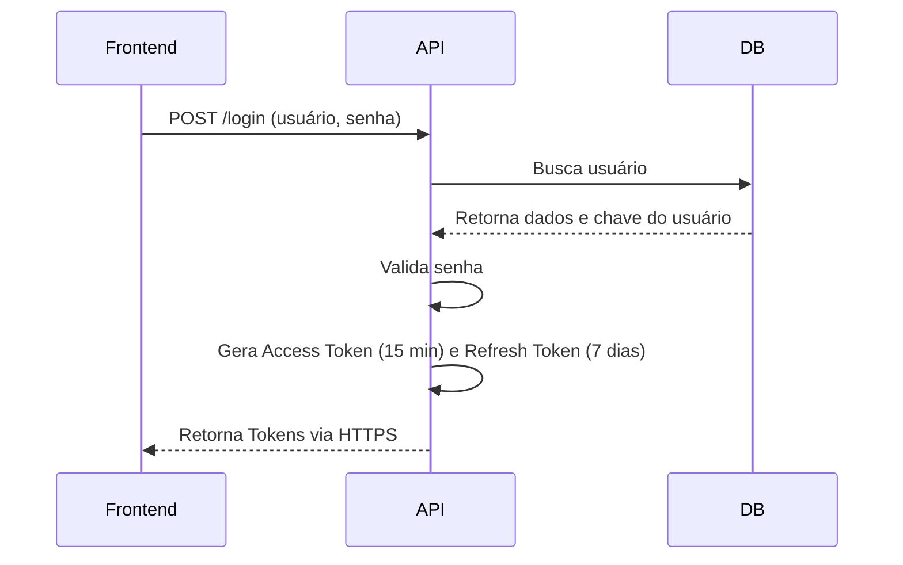
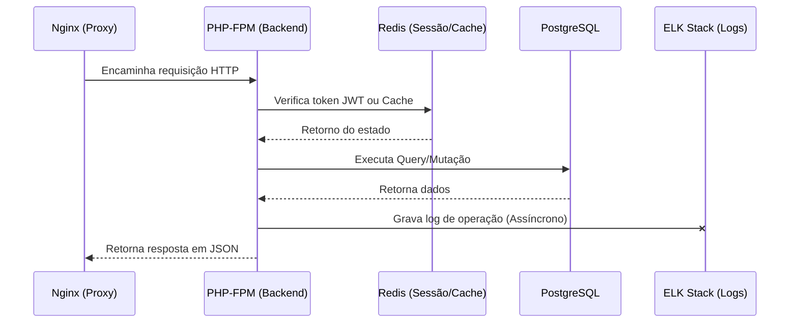
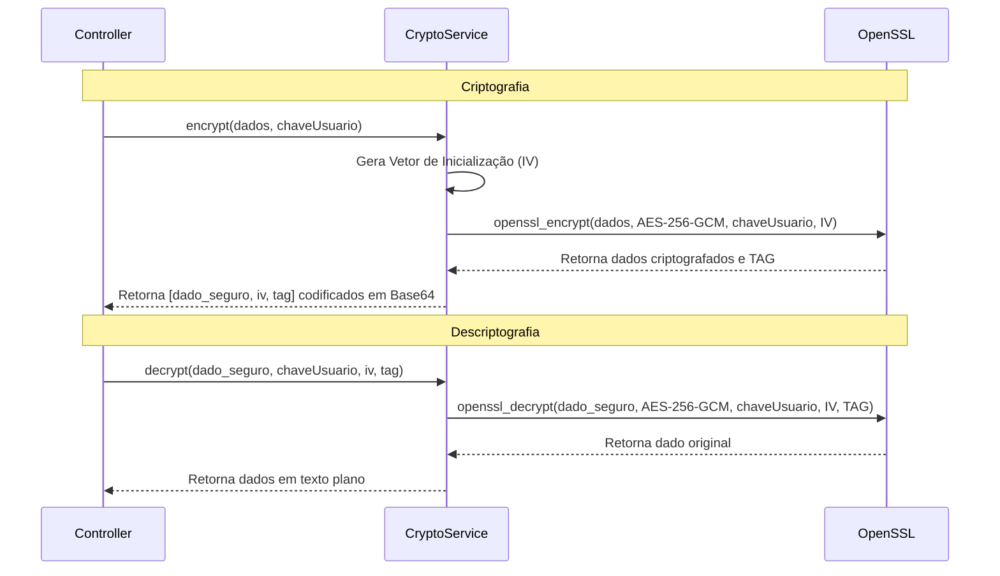
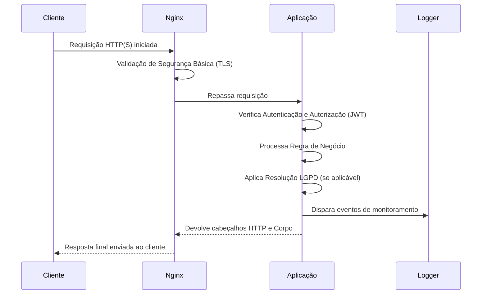

# Diagramas de Sequência UML

## 1. Fluxo de Autenticação

## 2. Comunicação entre Microsserviços

## 3. Processo de Criptografia e Descriptografia (AES-256-GCM)

## 4. Ciclo de Vida de Requisições

